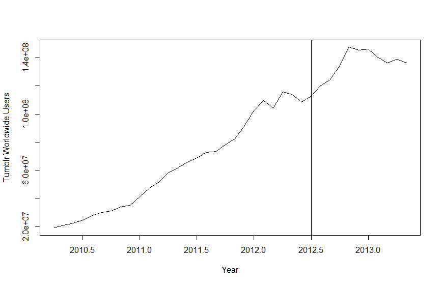

# Tumblr User Prediction
Prediction of user base for Tumblr using time-series analysis. Used as input for valuation of Tumblr (not included in code). Time series forecast methods used: ETS (additive and multiplicative), TBATS, ARIMA. 

Key finding is that Yahoo most likely overpaid for Tumblr acquisition.

## Executive Summary
Yahoo acquired Tumblr for $1.1 billion on May 20, 2013. At that point, Tumblr had 136 million people visit worldwide and a slowing user growth trend. Since user base is one of the key drivers of valuation, we attempt to forecast this variable in this analysis using time series method.

TBATS was chosen as the best performing method, using last 12 month users as inputs. With this, number of people on Tumblr is predicted to peak at 180 million, which would give an estimate of $425 million valuation for Tumblr, using adjusted Facebook ARPU as a proxy. Yahoo paid a premium of ~$600 million above Tumblr fair value, and it remains to be seen if other potential synergies can improve user growth, ARPU or reduce cost of capital to account for this premium.

## Analysis
Visualising Tumblr growth, we see a high growth of ~5.5% using the entire time series, and ~1.5% in the last 12 months

